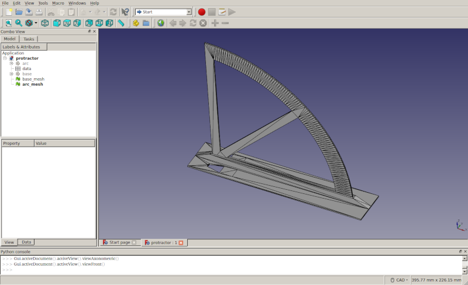
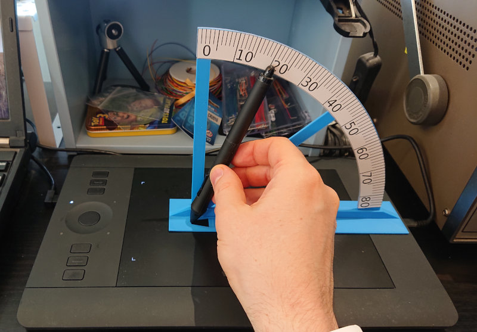
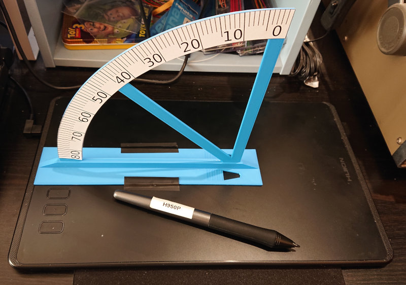

Protractor for measuring pen tilt angles
========================================
This is a FreeCAD model intended for 3D-printing a protractor for measuring
tilt angles of graphics tablet pens. It is accompanied by an SVG drawing of
the protractor labels. It can be used to determine a correlation between HID
input reports and actual angles. NOTE that the base corners tend to lift a
little when printing, even with a brim, at least when printing in PLA on Prusa
i3 MK3.

